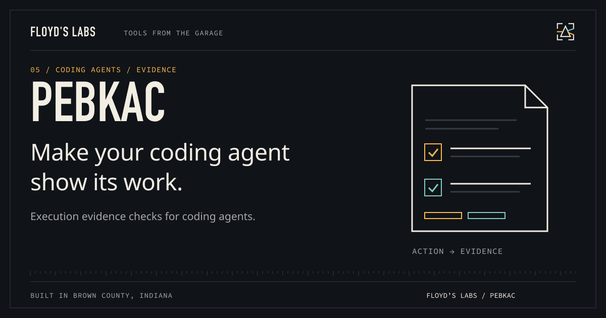

# PEBKAC



**Make the agent show its work.**

Project guardrails for coding agents: evidence checks, destructive-command guards, secret redaction, checkpoints, and a CLI to inspect the setup. Built at Floyd’s Labs: one garage, two black cats, and tools that have to earn the desk space.

[Download v1.1.0](https://github.com/CaptainPhantasy/pebkacv2/releases/tag/v1.1.0) · [Report a bug](https://github.com/CaptainPhantasy/pebkacv2/issues) · [Floyd’s Labs](https://floyd-labs-proving-ground.captainphantasy.chatgpt.site/open-source)

## Get it running

Requirements: **Bun 1.3+ for source; standalone macOS Apple Silicon binary available**.

On macOS with Apple Silicon, download and unpack the standalone package:

```sh
tar -xzf pebkac-1.1.0-macos-arm64.tar.gz
./pebkac-1.1.0-macos-arm64/pebkac version
./pebkac-1.1.0-macos-arm64/pebkac init --non-interactive --yes --cwd /path/to/project
./pebkac-1.1.0-macos-arm64/pebkac doctor --cwd /path/to/project
```

The binary includes Bun and the defense extension. It is unsigned; macOS may ask you to approve running a downloaded executable. Source users can unpack the source archive and run `bun bin/pebkac.js` with Bun 1.3+.

`init` installs project-scoped OMP, Claude, and Pi integration files and managed Git hooks when the folder is a Git repository. It preserves an existing Git hook as `.local`. User-wide Codex/ZCode integration is an explicit action: `pebkac platforms install codex` or `pebkac platforms install zcode`. Existing malformed Codex hook JSON is rejected rather than overwritten.

The configured agent runtime defaults to `omp`; install that runtime or set `pebkac config set agent_runtime none --cwd /path/to/project` for standalone inspection. `launch --dry-run` previews a command without requiring the runtime. Guardrails reduce mistakes; they do not provide a security sandbox or prove that an agent's claims are true.

## What is in the box

The release includes `pebkac-1.1.0-macos-arm64.tar.gz`, source where applicable, and `SHA256SUMS.txt`. Use the tagged release's named assets for installation; GitHub's automatic source archives are snapshots. Verify a download with `shasum -a 256 -c SHA256SUMS.txt` after downloading the matching files.

## Show the work

`bun test` runs isolated tests for guard behavior, redaction, CLI, platforms, checkpoints, and packaging resources. The standalone binary is separately run from a fresh directory. Agent integration tests use a simulated host; they do not certify every external agent version.

## Contribute or get help

Open an issue with your platform, version, command, and a minimal reproduction. Keep credentials and personal transcripts out of reports. See [CONTRIBUTING.md](CONTRIBUTING.md) and [SECURITY.md](SECURITY.md).

## License

The repository has no open-source license granting redistribution rights. Existing restrictions are preserved; a public download does not change those rights.

---

Built with intent. Bella checks the keyboard. Bowser watches the router.
